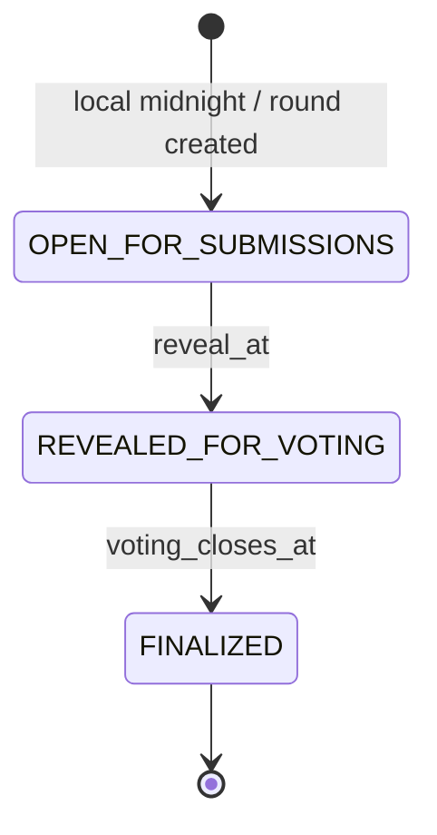

# Daily / Async Engine

## Product contract

Each daily group receives one prompt per calendar day in the group's IANA
timezone. Members submit independently until the configured reveal hour, vote
without seeing authors, and receive the finalized result after the voting
deadline. The prompt text is copied into the round so a future deck edit cannot
rewrite history.

Daily mode requires Postgres. It intentionally returns `503` in memory-only
local/demo mode because a habit loop that silently resets would violate the
product contract.

## Identity and authorization

Daily mode does not pretend to ship accounts. Creating or joining a group
creates a group-scoped membership and returns a 256-bit bearer token once. The
browser stores the token locally; Postgres stores only its SHA-256 digest.

Every group read, submission, vote, and delete resolves the token against the
resource's group. A guessed group code, membership UUID, round UUID, or
submission UUID is insufficient. The owner token is required to delete a group.
There is currently no cross-device token recovery; adding accounts later should
replace, not weaken, this boundary.

## State machine

- `OPEN_FOR_SUBMISSIONS`: only the requesting member's answer is returned.
- `REVEALED_FOR_VOTING`: all answers are returned, but author names and live
  vote totals are omitted. A member cannot vote for their own submission.
- `FINALIZED`: authors, totals, and every tied top-vote winner are returned.

The HTTP mutation checks both the stored state and the absolute deadline while
holding the round row lock. A late request cannot sneak through merely because
the worker has not updated the state column yet.

## Concurrency and retry behavior

Every app machine runs the same bounded polling worker. This does not require a
queue or leader election:

- the group row is locked before assigning the next per-group round number;
- `(group_id, round_date)` and `(group_id, round_number)` are unique;
- due transitions are conditional `UPDATE`s on the current state;
- submissions use one row per `(round, membership)` and retry as an update;
- votes use one row per `(round, voter)` and a retry changes the selection;
- composite foreign keys keep memberships, rounds, submissions, and voters in
  the same group at the database boundary.

`TestPostgresDailyLifecyclePrivacyIdempotencyAndConcurrentWorker` runs eight
workers concurrently and proves that exactly one next-day round is created.

## Time and streak semantics

- The group timezone is validated with Go's IANA timezone database.
- A round opens at local midnight and reveals at 18:00 local time by default.
- Voting closes 18 hours after reveal.
- A group streak counts consecutive finalized calendar days with at least two
  submissions. A single-person test round does not inflate the social streak.
- Daylight-saving changes are handled when local boundaries are constructed;
  persisted deadlines are UTC timestamps.

## Operational signals

The app exports:

- `punchline_daily_actions_total{action,result}`
- `punchline_daily_round_transitions_total{transition}`
- `punchline_daily_worker_errors_total`
- `punchline_daily_worker_last_success_unixtime`

Readiness checks both the shared Postgres dependency and the presence of the
daily schema. Alert when the worker has not succeeded for more than two worker
intervals or when its error counter rises.

## Current boundaries

- Membership tokens are browser-local and cannot be recovered on another
  device.
- There are no push/email notifications yet.
- The prompt catalog still comes from `seed/cards.json`; the chosen prompt is
  durably snapshotted into each round.
- Group owners can delete the group and all rounds. There is not yet an owner
  transfer or per-member leave API.
